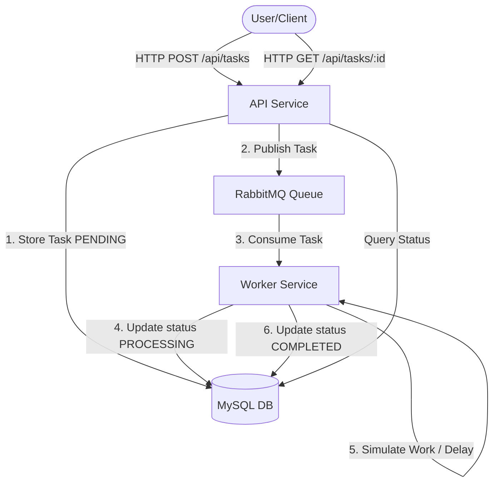

# Project Explanation: Asynchronous Task Processing API

This document provides a comprehensive overview of the project's architecture, services, and internal logic. The system is designed to handle time-consuming tasks asynchronously using a producer-consumer pattern mediated by RabbitMQ.

## 🏗 System Architecture

The project consists of three main components: An **API Service**, a **Worker Service**, and a **MySQL Database**. Communication between services is handled via **RabbitMQ**.

---

## 🚀 API Service (`api-service`)

The API service acts as the gateway for users to submit tasks and check their status. It is built using **Node.js** and **Express**.

### Key Files and Logic

#### 1. `src/main.js` (Entry Point)
- **Role**: Initializes the Express server, sets up middleware (JSON parsing), and registers task routes.
- **Port**: Defaults to `8000`.

#### 2. `src/api/tasks.js` (Routes)
- **`POST /`**: Accepts `title` and `description`.
  - **Input**: `{ "title": string, "description": string }`
  - **Output**: Returns `202 Accepted` with a `task_id` if valid.
  - **Validation**: Ensures title and description are non-empty strings.
- **`GET /:id`**: Retrieves current status and details of a task.
  - **Input**: `id` (UUID) as a path parameter.
  - **Output**: JSON object with task status, metadata, and timestamps. Returns `404` if not found.

#### 3. `src/services/taskService.js` (Business Logic)
- **`create(taskData)`**: 
  - Generates a unique **UUID-v4** for the task.
  - Saves the task to the database with a `PENDING` status.
  - Dispatches the task message to RabbitMQ's `task_queue`.
- **`find(id)`**: Proxies the database model to fetch a specific task.

#### 4. `src/rabbitmq/publisher.js` (Queue Producer)
- **`publishToQueue(queueName, data)`**: Connects to RabbitMQ, asserts a **durable** queue, and sends a **persistent** JSON message.

---

## 🛠 Worker Service (`worker-service`)

The Worker service processes tasks from the queue in the background, allowing the API to remain responsive.

### Key Files and Logic

#### 1. `src/main.js` (Entry Point)
- **Role**: Starts the worker process by establishing the RabbitMQ consumer connection.

#### 2. `src/rabbitmq/consumer.js` (Queue Consumer)
- **`connect()`**: 
  - Establishes a connection to RabbitMQ.
  - Listens for messages on `task_queue`.
  - Uses `prefetch(1)` to ensure the worker only handles one task at a time (sequential processing).
  - Handles message acknowledgments (**ACK**) only after successful processing.

#### 3. `src/services/worker.js` (Worker Logic)
- **`processTask(message)`**: 
  - **Step 1**: Sets task status to `PROCESSING` in the DB.
  - **Step 2**: Simulates a workload with a **5-second delay** (`setTimeout`).
  - **Step 3**: On success, sets status to `COMPLETED` and records `completed_at` timestamp.
  - **Step 4**: On failure, sets status to `FAILED`.

---

## 📂 Database Schema (`db`)

The system uses a MySQL database named `async_tasks_db`.

### `tasks` Table
| Column | Type | Description |
| :--- | :--- | :--- |
| `id` | `VARCHAR(36)` | Unique Task ID (Primary Key). |
| `title` | `VARCHAR(255)` | Short summary of the task. |
| `description` | `TEXT` | Detailed task information. |
| `status` | `ENUM` | `PENDING`, `PROCESSING`, `COMPLETED`, `FAILED`. |
| `metadata` | `JSON` | Optional additional task data. |
| `created_at` | `TIMESTAMP` | Auto-generated creation time. |
| `updated_at` | `TIMESTAMP` | Auto-updated modification time. |
| `completed_at`| `TIMESTAMP` | Set by worker upon task completion. |

---

## 🔄 Task Lifecycle Trace

1. **Client Submission**: User sends a `POST` request to the API.
2. **Persistence**: API saves record in MySQL (`status: PENDING`).
3. **Queueing**: API sends message `{ task_id, ... }` to RabbitMQ.
4. **Acquisition**: Worker picks up the message from the queue.
5. **Processing Start**: Worker updates DB to `PROCESSING`.
6. **Execution**: Worker simulates a 5-second task.
7. **Finalization**: Worker updates DB to `COMPLETED` and sends an `ACK` to RabbitMQ to remove the message from the queue.
8. **Status Check**: User polls `GET /api/tasks/:id` to see the updated status.
